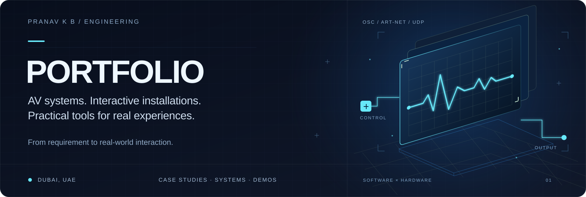

  

  <a href="projects/README.md"><strong>View projects</strong></a>
  &nbsp; · &nbsp;
  <a href="projects/hytecs/README.md">HYTECS projects</a>
  &nbsp; · &nbsp;
  <a href="https://github.com/pranavkb7">About me</a>
  &nbsp; · &nbsp;
  <a href="mailto:pranavkbijith@gmail.com">Contact me</a>

## Welcome

I’m **Pranav K B**, an AV Systems & Immersive Experience Engineer based in Dubai.

This portfolio is organized to show how I build video systems, interactive installations, show control, hardware integrations, and practical event applications.

## Start here

1. **[View projects](projects/README.md)** — Find project descriptions, diagrams, demos, and code as they are published.
2. **[Read about me](https://github.com/pranavkb7)** — See my background, areas of work, and tools.
3. **[Contact me](mailto:pranavkbijith@gmail.com)** — Get in touch about a project or collaboration.

## HYTECS company projects

A dedicated section for documenting my project work with **HYTECS**: the brief, my responsibilities, system setup, delivery, and results.

**[Open HYTECS projects →](projects/hytecs/README.md)**

## Current status

The portfolio structure is ready. **Project case studies and demos have not yet been published.**

## Project areas

| Area | What it means |
| :--- | :--- |
| Video systems | Video playback, LED display mapping, and video switching |
| Interactive installations | Systems that respond to a visitor’s movement, touch, or sensor input |
| Show control | Connecting video, lighting, and hardware so they work together |
| Hardware integration | Microcontrollers, motors, sensors, and physical controls |
| Event applications | Software for visitor interaction and event workflows |

## Find your way around

| File or folder | Purpose |
| :--- | :--- |
| **README.md** | This overview and navigation guide |
| **[projects/](projects/README.md)** | The project list and individual case studies |
| **[projects/hytecs/](projects/hytecs/README.md)** | HYTECS company project case studies |
| **[docs/hytecs-project-template.md](docs/hytecs-project-template.md)** | A template for a HYTECS company project |
| **[docs/project-template.md](docs/project-template.md)** | A template for documenting a new project |
| **portfolio.svg** | The portfolio banner |

## Add a new project

1. Create a folder inside `projects/` with a clear name, such as `sensor-controlled-playback`.
2. Copy the [project template](docs/project-template.md) into that folder as `README.md`.
3. Add the actual project details, setup instructions, screenshots, and demo links.
4. Link the new case study from the [project list](projects/README.md).

---

**Pranav K B** · AV Systems & Immersive Experience Engineer · Dubai, UAE  
[GitHub profile](https://github.com/pranavkb7) · [Email](mailto:pranavkbijith@gmail.com)

